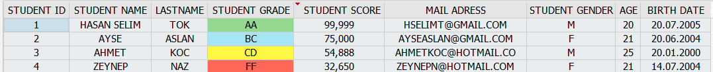

# 📚 UNI-GRADE




## ✨ Key Features

🔹 **Complete CRUD Operations** - Create, Read, Update, Delete students  
🔹 **Auto Age Management** - Ages refresh automatically every program execution  
🔹 **Smart Search System** - Multi-criteria search (ID, name, score range)  
🔹 **Grade Auto-Conversion** - Intelligent score-to-grade mapping (AA-FF scale)  
🔹 **ALV Grid Integration** - Professional SAP data presentation  
🔹 **Failed Student Tracking** - Dedicated table with grade upgrade logic  
🔹 **Real-time Analytics** - Pass/fail statistics, averages, top performers  
🔹 **Input Validation** - Email format and birth date verification  
🔹 **Enhanced UI** - Icons, colors, and intuitive interface design

## 🗄️ Database Architecture

### Custom Data Elements
| Element | Type | Length | Purpose |
|---------|------|--------|---------|
| `ZSTUDENTID_DE` | NUMC | 10 | Unique Student ID |
| `ZSTUDENTNAME_DE` | CHAR | 50 | First Name |
| `ZSTUDENTLNAME_DE` | CHAR | 50 | **Last Name** |
| `ZSTUDENTBDATE_DE` | DATS | 8 | **Birth Date** |
| `ZSTUDENTAGE_DE` | NUMC | 3 | **Current Age** |
| `ZSTUDENTMAIL_DE` | CHAR | 100 | **Email Address** |
| `ZSTUDENTGEN_DE` | CHAR | 1 | Gender (M/F) |
| `ZSTUDENT_SCORE_DE` | NUMC | 3 | Test Score (0-100) |
| `ZSTUDENT_GRADE_DE` | CHAR | 2 | Letter Grade (AA-FF) |

### Database Tables
- **`ZSTUDENT_T`** - Primary student records table
- **`ZFSTUDENT_T`** - Failed students tracking table

## ⚙️ Core Components

### 🧮 Utility Classes
```abap
lcl_age_calculator    → Calculates current age from birth date
lcl_grade_converter   → Converts numerical scores to letter grades
lcl_set_cell_color    → Sets cell colors according to score
```

### 📊 Grading System
| Score Range | Grade | Performance Level |
|-------------|-------|-------------------|
| 95-100 | **AA** | Excellent |
| 90-94  | **AB** | Very Good |  
| 85-89  | **BB** | Good |
| 75-84  | **BC** | Above Average |
| 55-74  | **CC** | Average |
| 45-54  | **CD** | Below Average |
| 35-44  | **DD** | Poor |
| 0-34   | **FF** | Fail |

## 🚀 Program Operations

| Operation | Description | Features |
|-----------|-------------|----------|
| **➕ Add Student** | Complete registration | Input validation, auto-grade calculation |
| **✏️ Update Student** | Modify records by ID | Selective field updates, age recalculation |
| **🔍 Search** | Multi-criteria lookup | ID/name/score range filtering |
| **📈 Statistics** | Analytics dashboard | ALV display, pass/fail metrics, top performers |
| **🔄 Auto Updates** | Data maintenance | Automatic age refresh on program start |
| **⬆️ Grade Upgrade** | Smart promotion | Auto DD upgrade for 34-35 score range |
| **🗑️ Clear Data** | Bulk operations | Mass deletion with confirmation dialog |
