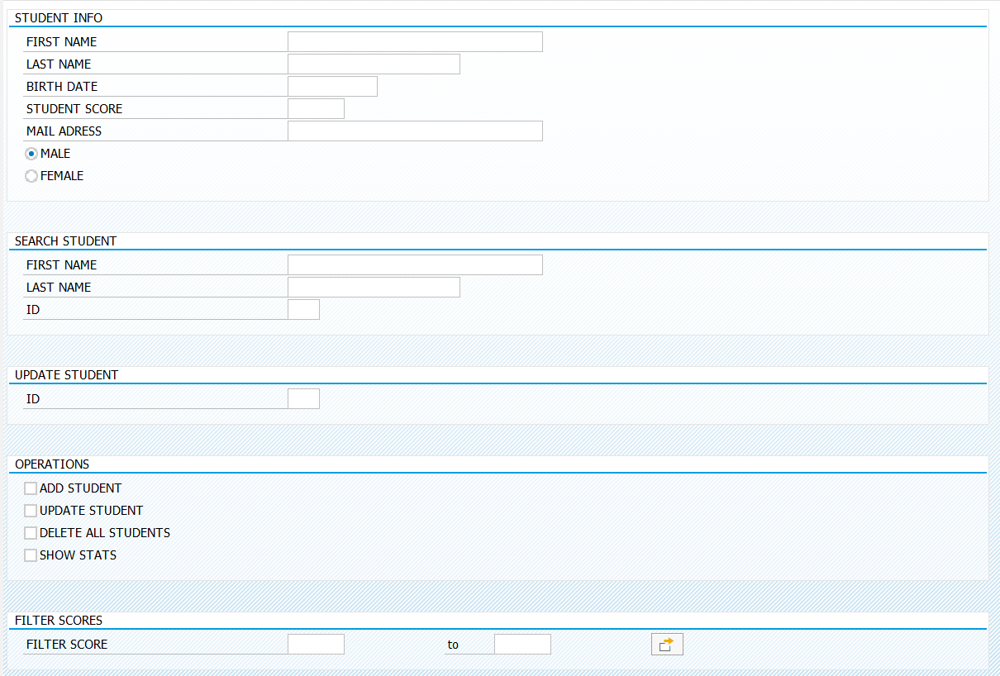

# UNI-GRADE
UNIVERSITY GRADE SYSTEM CODED IN ABAP

## Features
- Full CRUD operations (Create, Read, Update, Delete)
- Advanced filtering system by score ranges
- Automatic grade conversion (0-100 → AA-FF)
- Student search by name/ID
- Statistics dashboard with pass/fail analytics
- Failed student tracking

## Database Objects

### Data Elements
| Data Element | Type | Length | Description |
|--------------|------|---------|-------------|
| ZSTUDENTID_DE | NUMC | 10 | Student ID |
| ZSTUDENTNAME_DE | CHAR | 50 | Student Name |
| ZSTUDENTGEN_DE | CHAR | 1 | Gender (M/F) |
| ZSTUDENT_SCORE_DE | NUMC | 3 | Score (0-100) |
| ZSTUDENT_GRADE_DE | CHAR | 2 | Grade (AA-FF) |

### Tables
**ZSTUDENT_T** - Main Student Table
| Field | Data Element | Key | Description |
|-------|-------------|-----|-------------|
| STUDENTID | ZSTUDENTID_DE | ✓ | Student ID |
| STUDENTNAME | ZSTUDENTNAME_DE | | Student Name |
| STUDENTGEN | ZSTUDENTGEN_DE | | Gender |
| STUDENTSCORE | ZSTUDENT_SCORE_DE | | Test Score |
| STUDENTGRADE | ZSTUDENT_GRADE_DE | | Letter Grade |

**ZFSTUDENT_T** - Failed Students Table
| Field | Data Element | Key | Description |
|-------|-------------|-----|-------------|
| STUDENTID | ZSTUDENTID_DE | ✓ | Student ID |
| STUDENTNAME | ZSTUDENTNAME_DE | | Student Name |
| STUDENTGEN | ZSTUDENTGEN_DE | | Gender |
| STUDENTSCORE | ZSTUDENT_SCORE_DE | | Test Score |
| STUDENTGRADE | ZSTUDENT_GRADE_DE | | Letter Grade |

# Text Elements

## Text Symbols

| Symbol ID | Text | Length | Max |
|-----------|------|--------|-----|
| TEXT-001 | STUDENT INFO | 12 | 16 |
| TEXT-002 | GENDER | 6 | 16 |
| TEXT-003 | OPERATIONS | 10 | 13 |
| TEXT-004 | FILTER SCORES | 13 | 25 |
| TEXT-005 | SEARCH STUDENT | 14 | 25 |
| TEXT-006 | UPDATE STUDENT | 14 | 24 |

## Selection Texts

| Parameter | Text | DDIC Reference |
|-----------|------|----------------|
| P_ADD | ADD STUDENT | |
| P_CLEAR | DELETE ALL STUDENTS | |
| P_FEMALE | FEMALE | |
| P_MALE | MALE | |
| P_NAME | STUDENT FULLNAME | |
| P_SCORE | STUDENT SCORE | |
| P_SID | BY ID | |
| P_SNAME | BY FULLNAME | |
| P_STATS | SHOW STATS | |
| P_UID | BY ID | |
| P_UPDATE | UPDATE STUDENT | |
| S_SCORE | FILTER SCORE | |

## 📊 Grade Scale

| Score Range | Grade | Description |
|-------------|-------|-------------|
| 95-100      | AA    | Excellent   |
| 90-94       | AB    | Very Good   |
| 85-89       | BB    | Good        |
| 75-84       | BC    | Above Average|
| 55-74       | CC    | Average     |
| 45-54       | CD    | Below Average|
| 35-44       | DD    | Poor        |
| 0-34        | FF    | Fail        |

## 🎯 Program Operations

- **Add Student**: Enter student details and score
- **Update Student**: Modify existing student data by ID
- **Search**: Find students by name or ID
- **Statistics**: View comprehensive grade analytics
- **Filter**: Display students within score ranges
- **Clear Data**: Remove all student records (with confirmation)
